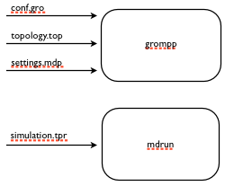

.. _mdtutorial:

***************************
Introductory Tutorial
***************************

This tutorial will get you introduced to the basics of copernicus. After
finishing this tutorial you will be able to:

* Setup a copernicus network ready to run projects and distribute tasks for you.

* Create a project workflow for molecular simulations.

* Learn how to monitor project progress, fetch results and alter input data while a project is running.

Installation
^^^^^^^^^^^^

The section :ref:`getting-started` of the User guide covers the installation of
Copernicus.

Tutorial files can be found [here](https://github.com/gromacs/copernicus/tree/master/examples/mdruns-test)

Creating a workflow for molecular simulations
^^^^^^^^^^^^^^^^^^^^^^^^^^^^^^^^^^^^^^^^^^^^^

In projects where one runs many variations of a simulation many small things add up and the process
can become tedious. Imagine having to manually copy over all files to various machines, run the
simulations and download them to another machine for postprocessing.
When work adds up the possibility for errors in simulations or machine errors also increases.

In this example we will build a molecular simulation workflow that lets us handle multiple simulations.
By providing a couple of input files we want this workflow to generate molecular simulation jobs.
Copernicus will then automatically distribute these jobs to available worker units and monitor them.
In cases things jobs go wrong they will be automatically regenerated and put back on the Copernicus
queue. In some cases things go wrong and requires user intervention. Copernicus will in these cases
halt that job and ask for a user to interact.
All of this allows the user to focus on the problem instead of having to focus on what things should run where.

Workflow components are called functions. Functions operate on inputs and generate outputs. Outputs of one function can be connected to the input of another functions.
Copernicus already has many ready made functions for Gromacs. We will utilize these to create our workflow.

Before we create a workflow we need to start a new project.

.. code-block:: none

   > cpcc start md_simulations
   Project md_simulations created

You can now see the newly created project in the projects list.

.. code-block:: none

   > cpcc projects
   Projects:
        md_simulations

The gromacs functions are available via the gromacs module
We import it with

.. code-block:: none

   > cpcc info gromacs

   \.\.\.\.\.\.

   \.\.\.\.\.\.

   grompps
        Prepares multiple simulations; can handle multiple input
        files.Each input is an array that can have N or 1 elements,
        where N is the number of desired outputs. If the number of
        inputs is Neach input will go to its own instance of grompp.
        If the number of inputs in an array is 1, this will be
        distributed along all the grompp instances. The output is an
        array of .tprs.
   mdruns
        Runs a set of MD simulations. Inputs are spread in the same
        way as grompps

   \.\.\.\.\.\.

Among the functions you will see two called grompps and mdruns. These two functions can handle multiple simulations.
lets start by creating one instance of grompps.

.. code-block:: none

    > cpcc instance gromacs::grompps grompp

This roughly translates to “create a workflow block that will use the grompps function from gromacs and lets call it grompp”.
Now we’ll create an instance of the mdruns function:

.. code-block:: none

    > cpcc instance gromacs::mdruns mdrun

If we list the currently instantiated workflow blocks:

.. code-block:: none

    > cpcc ls
    Network '':
    Network function instances:
        grompp (held)
        mdrun (held)

we see that the our grompp and mdrun blocks are there an there status is “held”, This means that they are currently inactivated and not running anything. When we have finished building the workflow we will activate them.
We have now created an instance to each function, however they are not connected yet.

    The current progress. We have now defined our first blocks but we still have not connected them

We will now connect the two block so it looks like this.

.. figure:: ../_static/grompp_mdrun_functions_connected.png
    :width: 521px
    :align: center
    :height: 92px
    :alt: Connected functions
    :figclass: align-center

    The look of the workflow after we have connected our blocks.

The output of grompp is tpr files, and we’d like grompp to pass these on to mdrun once it’s produced.

First we call the command ``cpcc transact``. This way we can send many commands at once and treat
them as if they are a single update. When we are finished sending commands, we’ll finish the
transaction block with the command ``cpcc commit``.
Once the transaction has started, we connect the blocks.
We do this by connecting the grompp tpr output to the mdrun tpr input.

.. code-block:: none

    > cpcc transact
    > cpcc connect grompp.out.tpr mdrun.in.tpr
    Scheduled to connect grompp.out.tpr to mdrun.in.tpr at commit

here you will notice syntax like grompp.out.tpr, These are called workflow paths. The next section
we’ll cover them in more detail. We can now activate all the workflow blocks. This means that they
should start listening to incoming input.

.. code-block:: none

    > cpcc activate

We finish the transaction by calling

.. code-block:: none

    > cpcc commit

This tells Copernicus that it should start processing all the commands that we have called during
this transaction.

At this stage we have finished building our workflow, and it’s ready to take input.

We will now use our created workflow to start some simulations

Listing workflow functions
^^^^^^^^^^^^^^^^^^^^^^^^^^

.. code-block:: none

    > cpcc ls
    Network '':
    Network function instances:
        grompp (active)
        mdrun(active)

Earlier when we used this command the functions where in a held state. This time we see that they
are active meaning that they will react if we provide input. We can also take a deeper look at an
individual function to see what inputs and outputs it handles. This is done by calling ``cpcc ls``
followed by the name of the function.

.. code-block:: none

     > cpcc ls grompp
    Instance 'grompp':
    Instance of: gromacs::grompps
    State: active
    Inputs:
        conf
        mdp
        top
        ndx
        settings
        include
    Outputs:
        tpr
    Subnet function instances:

Function inputs types can be inspected this way

.. code-block:: none

    > cpcc ls grompp.in
    Input/Output Value 'grompp:in':
    Type: grompp:in
    Sub-items:
        conf: conf_array
        mdp: mdp_file_array
        top: top_array
        ndx: ndx_array, optional
        settings: mdp_array_array, optional
        include: grompp_include_array_array, optional

This shows us that the conf, mdp and top inputs are array types, which means that we can provide
multiple conf files, leading to multiple simulations in this case. Later in the project we will use
this to actually start multiple simulations. We also see that the inputs ndx and settings have the
description “optional”, which means that the function can run without having set those inputs.
We can also look at the output types in a similar way:

.. code-block:: none

    > cpcc ls grompp.out

To inspect or set the actual values, we can use the ``cpcc set`` and ``cpcc get`` commands.
We will use these soon to provide input files to our projects and later take a look at the results.

Providing input files to our project.
^^^^^^^^^^^^^^^^^^^^^^^^^^^^^^^^^^^^^

To get things to run, we need to provide 3 input files: a configuration file, a topology file which
describes the system that we want to simulate, and an mdp file which contain the simulation settings
. These files are standard Gromacs file types, and for this tutorial you can find them ready made in
the tutorials directory.

we will use the ``cpcc setf`` command to provide the input files for our grompp function.

.. code-block:: none

    > cpcc setf grompp.in.conf[+] conf.gro
    Committing scheduled changes:
    - Set grompp:grompp:in.conf[0] to _inputs/0000/conf.gro

The section ``grompp:in.conf[+]`` specifies where a file should be sent to. in this case we want to
send it to the conf input. the last section ``[+]`` means “add this file”. Remember when we did
``cpcc ls grompp:in`` and we saw that the conf input was an array? that is why we can add files by
using the plus. lets add the topology file and the mdp file.

.. code-block:: none

    > cpcc setf grompp.in.top[+] topol.top
    Committing scheduled changes:
    - Set grompp:grompp:in.top[0] to _inputs/0001/topol.top

    > cpcc setf grompp.in.mdp[+] grompp.mdp
    Committing scheduled changes:
    - Set grompp:grompp:in.mdp[0] to _inputs/0002/grompp.mdp

Our grompp block has now gotten enough information to generate an output, and send it to the mdrun block, The mdrun block will then send a simulation job to the work queue.
By now the workflow should have gotten the input it needs to prepare a simulation.
If we take a look at the queue we should see that an item should have appeared.

.. code-block:: none

    > cpcc q
    Queue:
      0 mdrun:mdrun_0.1: gromacs/mdrun

This means server has generated a job and waiting for a worker to send it to.
If the worker is still running it should receive this job within maximum 30 seconds.
For the sake of this tutorial the simulation is very short and should be finished within a minute.
In reality a simulation could take days. The worker would in these cases send back intermediate
results to the server in one hour intervals.

Looking at the results
^^^^^^^^^^^^^^^^^^^^^^
After finishing the last job, we should have some results to look at. The outputs can be found in
the outputs of our mdrun block. We can simply download them to our computer by running a workflow
query and direct its output to a file. for example downloading the trajectory file

.. code-block:: none

    > cpcc getf mdrun.out.xtc[0] > ~/trajectory.xtc

which would download the trajectory to our home directory.
Again we see the square bracket syntax, this time with a digit instead of a plus sign.
As we noted earlier some inputs and outputs are array types. In the case of the output this means
that we can have multiple outputs. We specify which output we want to look at by specifying an index
number.

Running more simulations.
^^^^^^^^^^^^^^^^^^^^^^^^^

Usually, we want to run more than one simulation to obtain more samples and trajectories – with each
simulation having very similar settings. To run more simulations in our case, we can use some of
the inputs we have already provided. We will simply provide a few new configurations. We can cheat,
and provide the simulation the same configuration as before:

.. code-block:: none

    > cpcc setf grompp.in.conf[+] conf.gro

You can check the work queue to see the progress of this simulation.
When it’s done, try to call the command

.. code-block:: none

    > cpcc get mdrun:out.xtc
    mdrun:out.xtc: [
      mdrun/mdrun_0/_run_0000/traj.xtc,
      mdrun/mdrun_1/_run_0000/traj.xtc
    ]

which now gives two trajectory files. We can fetch the latest simulation trajectory with

.. code-block:: none

    > cpcc getf mdrun:out.xtc[1] > ~/trajectory_1.xtc

Pausing a project
^^^^^^^^^^^^^^^^^
Projects usually run until you decide its finished you can always pause them temporarily by calling.

.. code-block:: none

    > cpcc deactivate

To start the project again you call

.. code-block:: none

    > cpcc activate

Finishing a project
^^^^^^^^^^^^^^^^^^^

At one time you might want to finish a project and move it away from the server.
The command cpcc save will save your project and backup everything in a compressed file.

.. code-block:: none

    > cpcc save md_simulations
    Saved project to md_simulations.tar.gz

``cpcc save`` will also deactivate your project however it will not delete the project from the server.
You will need to do that yourself.

.. code-block:: none

    > cpcc rm md_simulations

To load a saved projects you call

.. code-block:: none

    > cpcc load md_simulations.tar.gz md_simulations
    Project restored as md_simulations

The project is restored but held in a deactivated state. you can start it with ``cpcc activate``.

